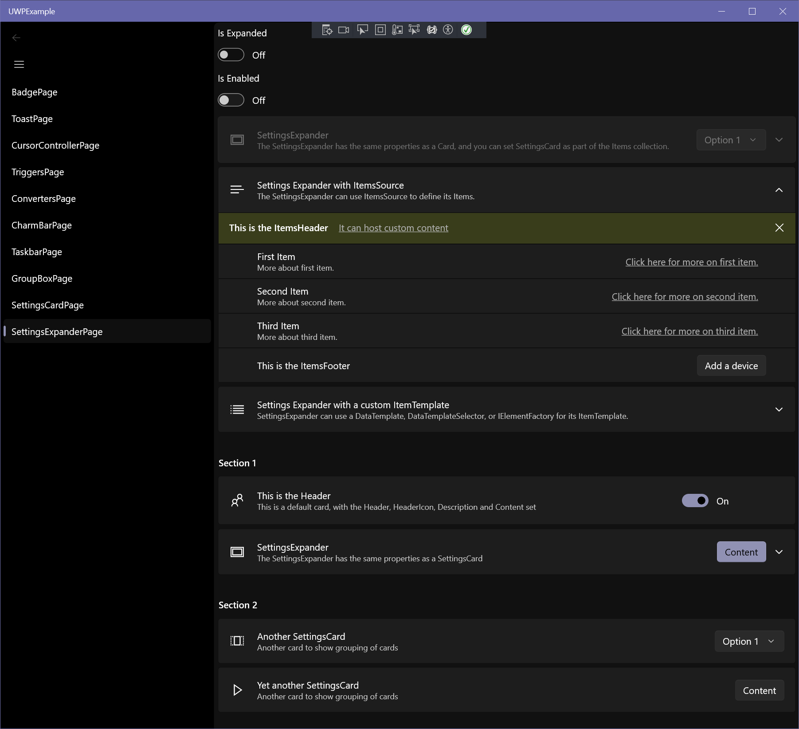
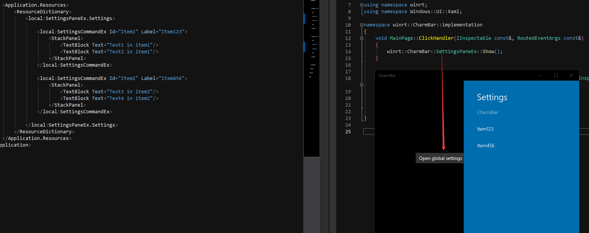
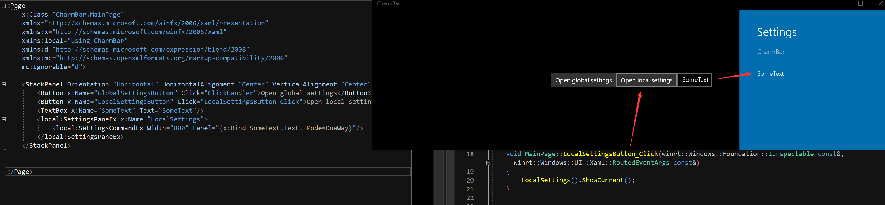
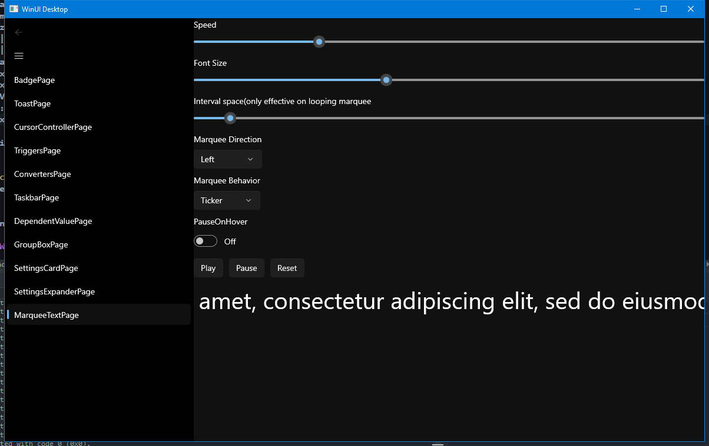

 
# WinUI Essentials
A repo dedicated for simplifying C++ development with WinUI2 (Universal Windows Platform) and WinUI3 (Windows App SDK).

## Usage
> [!WARNING]
> Make sure to set your C++ language version to C++20 first!

Open the `WinUIEssential.sln` containing 4 projects:
- UWPPackage (project for WinUIEssential.UWP nuget package)
- UWPExample (example gallery for using the above package)
- WinUI3Package (project for WinUIEssential.WinUI3 nuget package)
- WinUI3Example (example gallery for using the above package)

Build the `*Package` project will build the project and pack it with nuget, then install the nuget to your project and start using it.

To build the `*Example` project, do the same thing. They did not reference `*Package` for demo purposes.

> [!NOTE]
> Functionalities for UWP and WinUI3 should be exactly the same unless otherwise noted!

It should be useful until the [community toolkit](https://github.com/CommunityToolkit/WindowsCommunityToolkit) provides C++.

## Content
|Component|UWP|WinUI3|Type
|--|--|--|--|
|WinUIIncludes| :white_check_mark: | :x: | Header only
|TemplateControlHelper| :white_check_mark: | :white_check_mark: | Header only
|Glyphs| :white_check_mark: | :white_check_mark: | Header only + Xaml only
|BadgeGlyphs| :white_check_mark: | :white_check_mark: | Header only
|ToastTemplates| :white_check_mark: | :white_check_mark: | Header only
|ToastBuilder | :white_check_mark: | :white_check_mark: | Header only
|CursorController | :white_check_mark: | :white_check_mark: | WinRT component
|PropertyChangeHelper | :white_check_mark: | :white_check_mark: | Header only
|NegateBoolConverter | :white_check_mark: | :white_check_mark: | WinRT component
|BoolToVisibilityConverter | :white_check_mark: | :white_check_mark: | WinRT component
|ContainerToBoolConverter | :white_check_mark: | :white_check_mark: | WinRT component
|StringToBoolConverter | :white_check_mark: | :white_check_mark: | WinRT component
|ReferenceToBoolConverter | :white_check_mark: | :white_check_mark: | WinRT component
|ConverterGroup | :white_check_mark: | :white_check_mark: | WinRT component
|IsEqualStateTrigger| :white_check_mark: | :white_check_mark: | WinRT component
|IsNullOrEmptyStateTrigger | :white_check_mark: | :white_check_mark: | WinRT component
|ControlSizeTrigger | :white_check_mark: | :white_check_mark: | WinRT component
|CharmBar | :white_check_mark: | :x: | WinRT component
|GroupBox | :white_check_mark: | :white_check_mark: | Control
|SettingsCard | :white_check_mark: | :white_check_mark:* | Control
|SettingsExpander | :white_check_mark: | :white_check_mark:* | Control
|FontIconExtension | :white_check_mark: | :white_check_mark: | WinRT component
|DependentValue| :white_check_mark: | :white_check_mark: | WinRT component
|Taskbar| :x: | :white_check_mark: | Header only
|MarqueeText | :white_check_mark: | :white_check_mark: | Control

*means additional settings required, see the sections for info

---
## WinUIIncludes
Include the WinUI2 headers in your `pch.h`, so you don't waste your time figuring out where the compilation error comming from./

Usage:
Add this in your `pch.h`
```cpp
#include <WinUIIncludes.hpp>
```

## TemplateControlHelper
Automatically call `DefaultStyleKey()` for your templated control so you don't waste your time when you forget to include this line and get an empty control.

Usage: Inherit this class in your header file, make the template argument your **implementation type**.
```cpp
#include <TemplateControlHelper.hpp>
...
struct MyControl : MyControlT<MyControl>, TemplateControlHelper<MyControl>
{
    ...
};
```

## ToastHelper
Helper for creating toast notifications.

### ToastTemplates --- *namespace `ToastTemplates`*
The [built-in templates](https://learn.microsoft.com/en-us/uwp/api/windows.ui.notifications.toasttemplatetype?view=winrt-22621) re-written to strongly-typed classes that derived from `winrt::Windows::UI::Notification::ToastNotification`, so that you can directly use them as arguments for`winrt::Windows::UI::Notifications::ToastNotificationManager`. Example usage:
```cpp
#include <ToastTemplates.hpp>
winrt::Windows::UI::Notifications::ToastNotificationManager::CreateToastNotifier()
    .Show(ToastTemplates::ImageWithHeaderAndBody{ L"ms-appx:///Assets/Windows 11.png", L"Header", L"body" });
//alternatively use Microsoft's template name
winrt::Windows::UI::Notifications::ToastNotificationManager::CreateToastNotifier()
    .Show(ToastTemplates::ToastImageAndText02{ L"ms-appx:///Assets/Windows 11.png", L"Header", L"body" });
```

|Type|Template Name(which can also be used as type)|Sample|
|--|--|--|
|`BodyTextOnly`| `ToastText01` | 
|`SingleLineHeaderWithBody`| `ToastText02`| 
|`TwoLineHeaderWithBody`| `ToastText03`| 
|`HeaderWithTwoSingleLineBody`| `ToastText04`| 
|`ImageWithBodyOnly`| `ToastImageAndText01`| 
|`ImageWithHeaderAndBody`| `ToastImageAndText02`| 
|`ImageWithTwoLineHeaderAndBody`| `ToastImageAndText03`| 
|`ImageWithHeaderAndTwoSingleLineBody`| `ToastImageAndText04`| 

### ToastBuilder --- *namespace `ToastBuilder`*
Strongly-typed, declarative toast notification elements to quickly build toast notifications, as if you are writing XAML. [Schema here.](https://learn.microsoft.com/en-us/uwp/schemas/tiles/toastschema/root-elements) 
Example usage:
<table>
<tr>
    <td>XML</td> <td>C++</td>
<tr>
<tr>
<td>

```xml
<toast duration="long" scenario="reminder" useButtonStyle="true">
    <visual>
        <binding template="ToastText04">
            <text id="1">headline</text>
            <text id="2">body text1</text>
            <text id="3">body text2</text>
        </binding>
    </visual>
    <actions>
        <action content="Accept" arguments="accept"/>
    </actions>
</toast>
```
</td>
<td>

```cpp
Toast().Duration(Long).Scenario(Reminder).UseButtonStyle(true)
(
    Visual()
    (
        Binding().Template(L"ToastText04")
        (
            Text().Id(1)(L"headline"),
            Text().Id(2)(L"body text1"),
            Text().Id(3)(L"body text2")
        )
    ),
    Actions()
    (
        Action().Content(L"Accept").Arguments(L"accept")
    )
)
```

</td>
</tr>
<tr>
<td>

`<tag>...content...</tag>`

</td>
<td>

`Tag()(...content...)`

</td>
</tr>
<tr>
<td>

`attribute="value"`

</td>
<td>

`.Attribute(value)`

</td>
</tr>
<table>

Optionally add a handler to `Action` so you can handle toast notification button click right on site. For more info, see the comment documentation.
```cpp
Actions()
(
	Action().Content(L"Accept").Arguments(L"accept")
	.Click([this](winrt::Windows::ApplicationModel::Activation::ToastNotificationActivatedEventArgs args)
	{
        //Handle Accept button
	}),
	Action().Content(L"Cancel").Arguments(L"cancel")
	.Click([this](winrt::Windows::ApplicationModel::Activation::ToastNotificationActivatedEventArgs args)
	{
        //Handle Cancel button
	})
)
```

## Glphys --- *namespace `Glyphs`*
Font glyphs value for Segoe MDL2 Assets fonts. Usage:
```cpp
#include <Glyphs.hpp>
FontIcon().Glyph(Glyphs::GlobalNavButton);
```

There is also a `Glyph` xaml resource dictionary, so you can use name instead of glyph. Usage:
1. First add a reference to your `App.xaml` `MergedDictionaries`
```xml
<Application.Resources>
    <controls:XamlControlsResources>
        <controls:XamlControlsResources.MergedDictionaries>
            <ResourceDictionary Source="ms-appx:///Glyphs.xaml"/>
            ...
        </controls:XamlControlsResources.MergedDictionaries>
    </controls:XamlControlsResources>
</Application.Resources>
```
2. Then use `StaticResource` with name to reference the glyph
```xml
<FontIcon Glyph="{StaticResource Send}"/>
```

## CursorController --- *namespace `CursorController`*
Xaml helper for controlling the cursor type when mouse enters. 
Value for `Type` is [CoreCursorType enum](https://learn.microsoft.com/en-us/uwp/api/windows.ui.core.corecursortype?view=winrt-22621). Usage:
```xml
xmlns:essential="using:WinUI3Package"
...
<Rectangle Fill="Red" essential:CursorController.Type="Hand"/>
```

## PropertyChangeHelper --- *namespace `MvvmHelper`*
Helper for `OneWay` binding.

Usage: 
1. Inherit `Windows.UI.Xaml.Data.INotifyPropertyChanged` in `idl`
```
[default_interface]
runtimeclass MyPage : Windows.UI.Xaml.Controls.Page, Windows.UI.Xaml.Data.INotifyPropertyChanged
{
    ...
};
```

2. Inherit from this class in the implementation class.
```cpp
/*MyPage.xaml.h*/
#include <include/PropertyChangeHelper.hpp>

namespace winrt::<MyProject>::implementation
{
    struct MyPage : MyMusicT<MyMusic>, MvvmHelper::PropertyChangeHelper<MyMusic>
    {
        int m_value;
        void Value(int newValue)
        {
            compareAndRaise(m_value, newValue, L"Value");
        };
    }
}
```

## Converters
- bool -> Visibility *namespace `BoolToVisibilityConverter`*
- bool negation *namespace `NegateBoolConverter`*
- container (IVector, IMap) -> bool *namespace `ContainerToBoolConverter`*
- reference (any WinRT runtime type) -> bool *namespace `ReferenceToBoolConverter`*
- String -> bool *namespace `StringToBoolConverter`*
- ConverterGroups *namespace `ConverterGroups`*:
  + define series of converters, that convert value from converter1 -> converter2 -> ...
  + usage:
  ```xml
   <essential:ConverterGroup x:Key="StringToVisibilityConverter">
       <essential:StringToBoolConverter/>
       <essential:BoolToVisibilityConverter/>
   </essential:ConverterGroup>
  ```

## BadgeGlyphs --- *namespace `BadgeGlyphs`*
Helpers for creating badge notification xml.
Usage:
```cpp
#include <include/BadgeGlyphs.hpp>

//glyph badge
winrt::Windows::UI::Notifications::BadgeUpdateManager::CreateBadgeUpdaterForApplication()
	.Update(BadgeGlyphs::MakeBadgeNotification(BadgeGlyphs::Alert));

//number badge
winrt::Windows::UI::Notifications::BadgeUpdateManager::CreateBadgeUpdaterForApplication()
	.Update(BadgeGlyphs::MakeBadgeNotification(1));
```

## Triggers
See the same class in [Community Toolkit](https://github.com/CommunityToolkit/Windows) for documentation.
### ControlSizeTrigger --- *namespace `ControlSizeTrigger`*
### IsEqualStateTrigger --- *namespace `IsEqualStateTrigger`*
### IsNullOrEmptyStateTrigger --- *namespace `IsNullOrEmptyStateTrigger`*

## SettingsCard --- *namespace `SettingsCard`*
See the same class in [Community Tookit](https://github.com/CommunityToolkit/Windows) for documentation.
Add this to `App.xaml`
```xml
<Application.Resources>
    <controls:XamlControlsResources>
        <controls:XamlControlsResources.MergedDictionaries>
            <ResourceDictionary Source="ms-appx:///SettingsCard_Resource.xaml"/>
            ...
        </controls:XamlControlsResources.MergedDictionaries>
    </controls:XamlControlsResources>
</Application.Resources>
```
> [!NOTE]
> For WinUI3, add `#include #include <winrt/Microsoft.UI.Xaml.Controls.AnimatedVisuals.h>` to your `pch.h`

## SettingsExpander --- *namespace `SettingsExpander`*
See the same class in [Community Tookit](https://github.com/CommunityToolkit/Windows) for documentation.

Add this to `App.xaml`
```xml
<Application.Resources>
    <controls:XamlControlsResources>
        <controls:XamlControlsResources.MergedDictionaries>
            <ResourceDictionary Source="ms-appx:///SettingsCard_Resource.xaml"/>
            <ResourceDictionary Source="ms-appx:///SettingsExpander_Resource.xaml"/>
            ...
        </controls:XamlControlsResources.MergedDictionaries>
    </controls:XamlControlsResources>
</Application.Resources>
```

> [!NOTE]
> For WinUI3, add `#include #include <winrt/Microsoft.UI.Xaml.Controls.AnimatedVisuals.h>` to your `pch.h`

## CharmBar
Installing this nuget will automatically add `Desktop Extension` to your UWP project, so  you can use the good-ol Windows 8 style charm bar. This package further simplifies it's usage by allowing you to directly define local and global settings, directly in XAML containing UI element.

- Define a global setting in resource section, with `SettingsPaneEx.Settings`
```xml
<Application.Resources>
    <ResourceDictionary>
        <essential:SettingsPaneEx.Settings>
            <!--SettingsCommandEx items-->
            <essential:SettingsCommandEx Id="Item1" Label="Item123">
                <StackPanel>
                    <TextBlock Text="Text1 in item1"/>
                    <TextBlock Text="Text2 in item1"/>
                </StackPanel>
            </essential:SettingsCommandEx>=
            <essential:SettingsCommandEx Id="Item2" Label="Item456">
                <StackPanel>
                    <TextBlock Text="Text3 in item2"/>
                    <TextBlock Text="Text4 in item2"/>
                </StackPanel>
            </essential:SettingsCommandEx>
        </essential:SettingsPaneEx.Settings>
    </ResourceDictionary>
</Application.Resources>
```

- Define local settings, where you put instance of `SettingsPaneEx` directly in UI as any other xaml controls.
```xml
<Page
    ...
>
    <StackPanel Orientation="Horizontal" HorizontalAlignment="Center" VerticalAlignment="Center">
        <essential:SettingsPaneEx x:Name="LocalSettings">
            <!--SettingsCommandEx items-->
            ...
        </essential:SettingsPaneEx>
    </StackPanel>
</Page>
```


Define keyboard shortcuts with `SettingsPaneEx.KeyboardAccelerator` property.
```
<essential:SettingsPaneEx.KeyboardAccelerator>
    <KeyboardAccelerator Modifiers="Control" Key="s"/> <!-- Ctrl+S to open settings -->
</essential:SettingsPaneEx.KeyboardAccelerator>
```
## DependentValue ---*namespace `DependentValue`*
A wrapper around a `double` which you can target to with a `Storyboard` and `DoubleAnimation`, and get value out of it. Value is accessed by `.Value` property, which is a `DependencyProperty`, so you can do a `OneWay` binding to it or listen for value change notification.

> [!NOTE]
> Remember to set `EnableDependentAnimation="True"` to make it work!

Usage:
```xml
<Page.Resources>
    <essential:DependentValue x:Name="MyDoubleValue"/>
    <Storyboard x:Name="DoubleValueAnimation">
        <DoubleAnimation  
            From="0"
            To="100"
            Storyboard.TargetName="MyDoubleValue"
            Storyboard.TargetProperty="Value"
            EnableDependentAnimation="True"/>
    </Storyboard>
</Page.Resources>

<StackPanel Orientation="Horizontal" HorizontalAlignment="Center" VerticalAlignment="Center">
    <Button Click="ClickHandler">Click to start storyboard</Button>
    <TextBlock Text="{x:Bind MyDoubleValue.Value, Mode=OneWay}"/>
</StackPanel>
```

## Taskbar --- *namespace `Taskbar`*
Helper for setting taskbar status and progress. Usage:
```cpp
//Set taskbar status
Taskbar::SetProgressState(hwnd, Taskbar::ProgressState::Normal);
//Set taskbar progress value 
Taskbar::SetProgressValue(hwnd, 50); //a third optional parameter for total, default -> 100
```

## MarqueeText --- *namespace `MarqueeText`*
Enhanced version of `MarqueeText` in the community toolkit.

